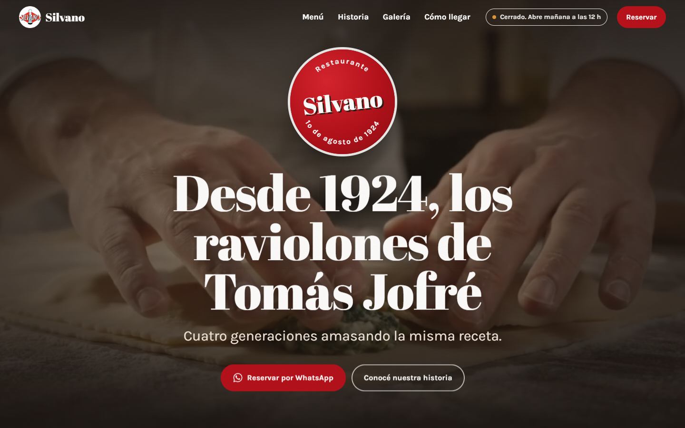
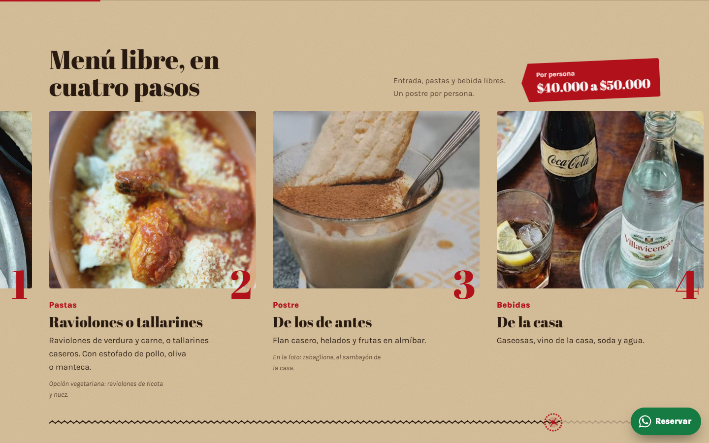
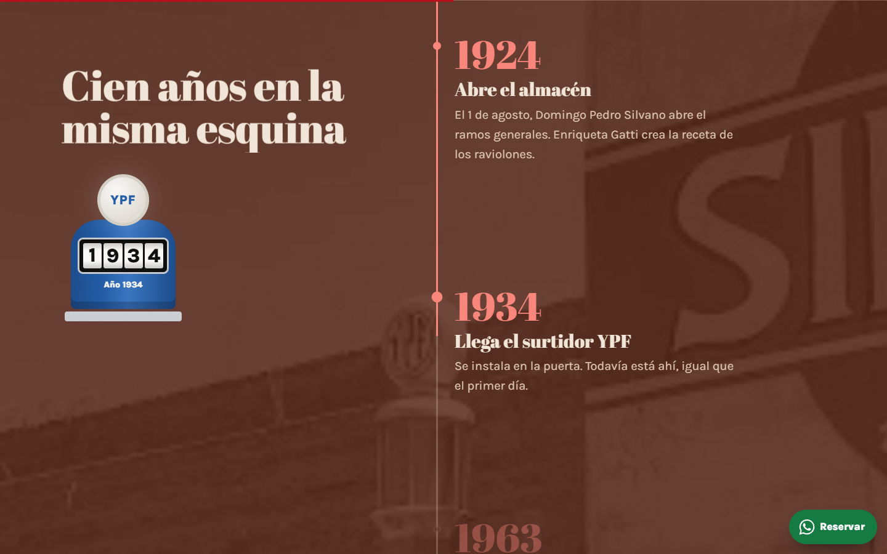
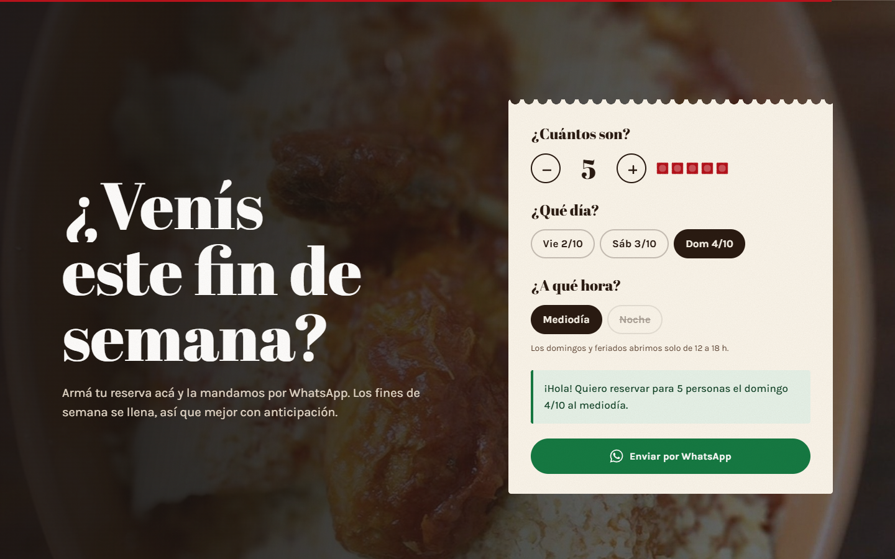

# Silvano: restaurante de campo desde 1924

Sitio web para **Silvano**, el primer restaurante de Tomás Jofré (Buenos Aires): un almacén de ramos generales de 1924 donde cuatro generaciones amasan la misma receta de raviolones.

**Sitio en vivo:** [silvano-lilac.vercel.app](https://silvano-lilac.vercel.app)



## La idea

La identidad visual sale del propio lugar, no de una plantilla:

| Elemento del lugar | Cómo aparece en el sitio |
| --- | --- |
| Cartel rojo de la fachada (1924) | Sello animado del inicio y color de acción |
| Surtidor YPF celeste (1934) | Contador de años de la sección Historia |
| Papel madera del almacén | Fondo principal con textura de fibra |
| Mesada de granito y harina | Sección "1.800 raviolones" con moteado y harina flotante |
| Ladrillo de la fachada | Fondo de la línea de tiempo |

Tipografía: **Abril Fatface** (letra de afiche de época) y **Karla** para el texto.

## Interacciones con el scroll

- **Inicio:** el video se recorta como una foto al bajar y el cartel gira.
- **Color de fondo:** cambia suavemente entre secciones (papel, granito, ladrillo).
- **Menú:** queda fijo y los cuatro pasos se desplazan en horizontal; una ruedita de cortar ravioles marca el avance.
- **1.800 raviolones por día:** un tablero se llena de ravioles con el scroll y se pueden "cerrar" con el mouse o el dedo.
- **Historia:** un surtidor YPF gira sus dígitos de 1905 a hoy mientras avanza la línea de tiempo.
- **Cómo llegar:** la ruta Mercedes–Tomás Jofré se dibuja y cuenta los 15 minutos.
- **Marquesina:** acelera y cambia de sentido según la velocidad del scroll.




## Funciones

- **Abierto o cerrado en tiempo real**, calculado con la hora de Argentina.
- **Reserva guiada:** se eligen personas, día (próximo viernes, sábado o domingo) y turno, y se genera el mensaje de WhatsApp. Los turnos que no existen se deshabilitan (el domingo no hay noche).
- **Galería** con filtros animados (GSAP Flip) y visor con teclado y swipe.



## Tecnología

- HTML, CSS y JavaScript, sin framework ni paso de build
- [GSAP](https://gsap.com) con ScrollTrigger y Flip para las animaciones
- [Lenis](https://lenis.darkroom.engineering) para el scroll suave
- Librerías servidas desde el propio dominio, sin CDNs
- Publicado en [Vercel](https://vercel.com)

## Accesibilidad y rendimiento

- Responsive de 360 px a pantallas grandes (celular, tablet, iPad y PC)
- Respeta `prefers-reduced-motion`: sin animaciones, la página se ve completa
- Navegación con teclado, foco visible, enlace para saltar al contenido y foco atrapado en el visor de fotos
- Si las librerías no cargan, todo el contenido sigue visible
- Datos estructurados de restaurante (schema.org) para buscadores

## Correr en local

No necesita instalación, pero hay que servir la carpeta (los scripts usan rutas absolutas):

```bash
npx serve .
```

## Estructura

```
├── index.html        página principal
├── privacidad.html   política de privacidad
├── terminos.html     términos y condiciones
├── 404.html          página de error
├── styles.css        tokens y estilos por sección
├── main.js           scroll suave, animaciones, reserva, galería
├── legales.js        año del pie en las páginas legales
├── vercel.json       URLs limpias, cabeceras de seguridad y caché
├── robots.txt, sitemap.xml, security.txt
├── vendor/           GSAP, ScrollTrigger, Flip y Lenis
├── assets/
│   ├── img/          fotos del restaurante y logo
│   └── video/        video del inicio
├── fuentes/          material original (no se publica)
└── docs/             capturas para este README (no se publica)
```

## Aspectos legales

- **Política de privacidad** ([`privacidad.html`](privacidad.html)) según la Ley 25.326: datos técnicos, WhatsApp, servicios de terceros, transferencia internacional, derechos y la autoridad de control (AAIP).
- **Términos y condiciones** ([`terminos.html`](terminos.html)): precios orientativos, reservas, alérgenos, propiedad intelectual (Ley 11.723), Defensa del Consumidor (Ley 24.240) y jurisdicción.
- **Bebidas alcohólicas:** leyenda de la Ley 24.788 en el menú, el pie de página y los términos.
- **Sin datos ni cookies propias:** la reserva se arma en el navegador y se envía por WhatsApp.
- **Pendiente del restaurante:** completar razón social, CUIT y domicilio legal en las dos páginas legales (están marcados entre corchetes).

## Seguridad

- **Content Security Policy** estricta: `script-src 'self'` más el hash del único script inline, sin CDNs de terceros.
- Librerías servidas desde el propio dominio ([`vendor/`](vendor)) con versiones congeladas.
- HSTS, `X-Frame-Options: DENY`, `Permissions-Policy`, `Referrer-Policy` y aislamiento de origen, todo en [`vercel.json`](vercel.json).
- [`security.txt`](security.txt) según RFC 9116.
- Las URLs de `*.vercel.app` llevan `X-Robots-Tag: noindex`, así que la versión de prueba no compite en Google con el dominio final.

## Aviso

Este sitio es una **propuesta de rediseño** presentada a Restaurante Silvano. Hasta que el restaurante la apruebe, no es su sitio oficial.

El código está bajo licencia MIT. El nombre, el logo, las fotografías y el video pertenecen a Restaurante Silvano y **no** están incluidos en esa licencia. Más detalles en [`LICENSE`](LICENSE).

---

Diseño y desarrollo: **Pedro Marzano**
